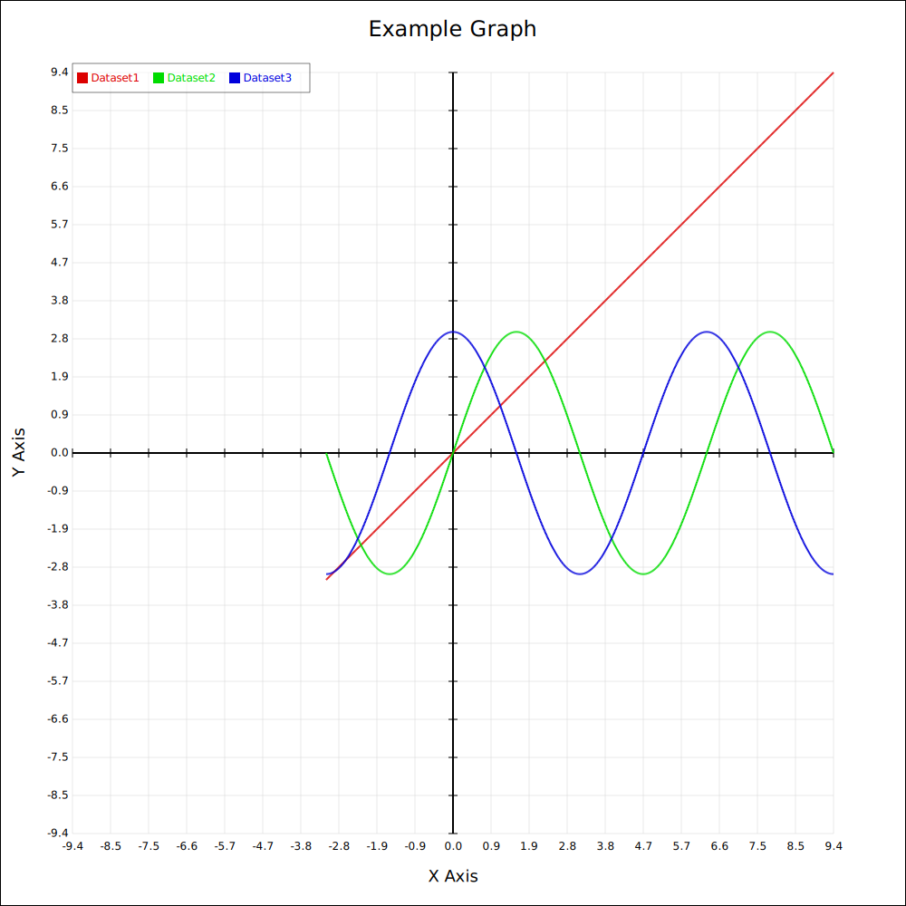
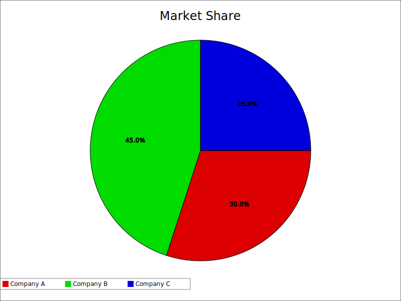

# DataViz Screenshots

This repository contains various DataViz visualizations created for the project. Below are previews of the graphs available in this repository.

---

## Area Chart

---

## Cartesian Graph
### PNG

### SVG

---

## Grouped Horizontal Bar Chart
### PNG

### SVG

---

## Grouped Vertical Bar Chart
### PNG

### SVG

---

## Histogram
### PNG

### SVG

---

## Pie Chart
### PNG

### SVG

---

## Quadrant 1 Graph
### PNG

### SVG

---

## Scatter Graph
### PNG

### SVG

---

## Real-Time Visualization

---

## License
This repository is licensed under the [LICENSE](LICENSE) file.
